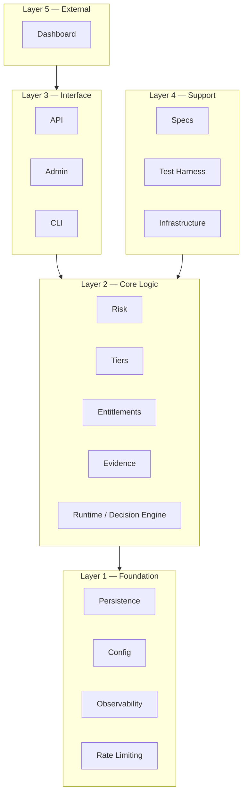

# PayFlux System Taxonomy

> Canonical architectural classification for the PayFlux platform.
> Single source of truth for system domains, primitives, and runtime artifacts.
> Derived strictly from code as of 2026-02-16.

---

## 1. System Overview

PayFlux is a payment risk observability platform. It ingests payment events from upstream processors via an authenticated HTTP API, routes them through a Redis Streams pipeline, computes deterministic risk scores using a sliding-window algorithm, emits warnings for elevated risk bands, and surfaces all signals and evidence through a tiered evidence export system. A separate Decision Engine process monitors runtime health metrics, maintains an adaptive baseline, and produces deployment-safety decisions. The platform enforces signal-level tier gating, per-account rate limiting, and entitlement-based access control across four product tiers (`baseline`, `proof`, `shield`, `fortress`).

---

## 2. Architecture Domains (Layered Hierarchy)



### Layer 1 — Foundation

| Domain | Root Location | Purpose |
|---|---|---|
| **Persistence** | `internal/logsafe/`, Redis, filesystem | PII redaction, Redis Streams, atomic file writes |
| **Config** | `internal/config/`, `config/` | Signal resolution, runtime overrides, audit logging, runtime JSON configs |
| **Observability** | `internal/metrics/` | Prometheus metrics for signals, tiers, enforcement, entitlements |
| **Rate Limiting** | `internal/ratelimit/` | Atomic token-bucket rate limiter (Redis Lua) |

### Layer 2 — Core Logic

| Domain | Root Location | Purpose |
|---|---|---|
| **Runtime (Decision Engine)** | `internal/runtime/` | Decision engine, adaptive baseline, causal analysis, deployment safety loop |
| **Risk** | `risk_score.go`, `warnings.go` | Sliding-window risk scoring, risk band classification, warning store |
| **Tiers** | `internal/tiers/` | Tier registry, tier-to-signal mapping, wildcard pattern matching |
| **Entitlements** | `internal/entitlements/` | Tier entitlements registry, enforcement middleware, concurrency limiter, retention enforcement |
| **Evidence** | `internal/evidence/` | Evidence envelope generation, canonicalization, deterministic JSON output |

### Layer 3 — Interface

| Domain | Root Location | Purpose |
|---|---|---|
| **API** | `main.go`, `evidence_handler.go`, `pilot_dashboard.go` | HTTP ingest, evidence export, pilot dashboard, health endpoints |
| **Admin** | `internal/admin/` | Internal signal override API handlers |
| **CLI** | `cmd/` | Binary entry points: consumer, decision-engine, signalctl, test-runner, generators |

### Layer 4 — Support

| Domain | Root Location | Purpose |
|---|---|---|
| **Specs** | `internal/specs/` | Signal registry schema, registry validation |
| **Test Harness** | `internal/testharness/` | Anomaly detection testing, merchant simulation, telemetry analysis |
| **Infrastructure** | `deploy/`, `Dockerfile`, `scripts/` | Docker, docker-compose, k8s, systemd, Vector, deployment scripts |

### Layer 5 — External

| Domain | Root Location | Purpose |
|---|---|---|
| **Dashboard** | `apps/dashboard/` | Next.js-based trust dashboard (separate TypeScript application) |

---

## 3. Subsystems

### 3.1 Runtime

| Subsystem | File(s) | Responsibility |
|---|---|---|
| Decision Engine | `internal/runtime/guardian/guardian.go` | Periodic metrics collection, deviation scoring, decision emission |
| Metrics Collector | `internal/runtime/guardian/guardian.go:collect()` | Health check integration and Prometheus metric scraping |
| Adaptive Baseline | `internal/runtime/guardian/baseline.go` | Exponential-smoothing baseline learning with z-score deviation scoring |
| Causal Analyzer | `internal/runtime/guardian/causal.go` | Root-cause attribution (traffic spike, memory leak, slow dependency, cold start, deploy impact) |
| Invariant Validator | `internal/runtime/guardian/invariants.go` | Pure-function invariant validation of Decision Engine outputs |
| Timeline Buffer | `internal/runtime/guardian/timeline.go` | Bounded ring-buffer decision history with atomic persistence |
| Trace Log | `internal/runtime/guardian/trace.go` | Full evaluation cycle capture for deterministic replay |
| Entitlement Context | `internal/runtime/entitlementctx/adapter.go` | Context adapter for tier-aware entitlement propagation |

### 3.2 Risk

| Subsystem | File(s) | Responsibility |
|---|---|---|
| Risk Scorer | `risk_score.go` | Sliding-window risk scoring per processor with weighted component model |
| Warning Store | `warnings.go` | LRU-bounded in-memory store for risk warnings with outcome annotation |

### 3.3 Config

| Subsystem | File(s) | Responsibility |
|---|---|---|
| Signal Loader | `internal/config/load_signals.go` | Loads signal definitions from `config/signals.runtime.json` |
| Signal Resolution | `internal/config/signal_resolution.go` | Resolution chain: tier check → runtime override → canonical spec |
| Override Store | `internal/config/signal_overrides.go` | Thread-safe copy-on-write override storage with atomic reads |
| Audit Logger | `internal/config/audit_log.go` | Append-only JSONL audit log for override changes |

### 3.4 Entitlements

| Subsystem | File(s) | Responsibility |
|---|---|---|
| Entitlements Registry | `internal/entitlements/entitlements.go` | Tier entitlements loading, validation, O(1) lookup |
| Enforcement Middleware | `internal/entitlements/middleware.go` | HTTP middleware for tier resolution, concurrency limiting, SLA headers |
| Concurrency Limiter | `internal/entitlements/limiter.go` | Per-tier atomic concurrent request limiting |
| Retention Enforcement | `internal/entitlements/enforcement.go` | Time-based artifact retention gating |
| Config Validation | `internal/entitlements/validation.go` | JSON Schema validation with monotonic tier progression checks |

### 3.5 Evidence

| Subsystem | File(s) | Responsibility |
|---|---|---|
| Envelope Generator | `internal/evidence/evidence.go` | Pipeline: Filter → Normalize → Stabilize → Sort → Clamp → Canonicalize |
| Evidence Handler | `evidence_handler.go` | HTTP handler for evidence export with tier-based retention filtering |
| Evidence Health | `evidence_handler.go` | Degradation counter, health endpoint for export capability detection |

### 3.6 Tiers

| Subsystem | File(s) | Responsibility |
|---|---|---|
| Tier Registry | `internal/tiers/tier_registry.go` | Compile-time signal-to-tier mapping with wildcard pattern support |
| Tier Resolution | `internal/tiers/tier_resolution.go` | Signal access resolution with reason codes |
| Tier Validation | `internal/tiers/tier_validation.go` | Tier config structural validation |

### 3.7 CLI Binaries

| Binary | Path | Purpose |
|---|---|---|
| `consumer` | `cmd/consumer/` | Standalone Redis stream consumer |
| `guardian` | `cmd/guardian/` | Decision Engine entry point |
| `signalctl` | `cmd/signalctl/` | Signal management CLI tool |
| `test-runner` | `cmd/test-runner/` | Test execution runner |
| `test-analysis` | `cmd/test-analysis/` | Test result analysis |
| `test-tier-validation` | `cmd/test-tier-validation/` | Tier configuration validation |
| `generate-customer-registry` | `cmd/generate-customer-registry/` | Customer registry code generation |
| `generate-runtime-config` | `cmd/generate-runtime-config/` | Runtime config code generation |
| `generate-tier-registry` | `cmd/generate-tier-registry/` | Tier registry code generation |

---

## 4. Core Primitives

### 4.1 RiskScorer

| Property | Value |
|---|---|
| **Name** | `RiskScorer` |
| **Layer** | Risk |
| **Responsibility** | Sliding-window per-processor risk scoring with weighted multi-component model |
| **Inputs** | `Event` (event_type, processor, failure_origin, retry_count, geo_bucket, result) |
| **Outputs** | `RiskResult` (score, band, drivers, trajectory) |
| **Determinism** | Yes — same event sequence over same window produces identical score |
| **Bounded** | Yes — fixed-size bucket array per processor, configurable window, score clamped to [0, 1] |

### 4.2 WarningStore

| Property | Value |
|---|---|
| **Name** | `WarningStore` |
| **Layer** | Risk |
| **Responsibility** | LRU-bounded in-memory storage of risk warnings with outcome annotation |
| **Inputs** | `Warning` (risk score, band, drivers, processor, merchant, event metadata) |
| **Outputs** | `[]*Warning` (filtered, ordered, with outcome fields) |
| **Determinism** | Yes — LRU eviction is ordered, outcome annotation is idempotent |
| **Bounded** | Yes — fixed capacity, oldest entries evicted |

### 4.3 AdaptiveBaseline

| Property | Value |
|---|---|
| **Name** | `AdaptiveBaseline` |
| **Layer** | Runtime |
| **Responsibility** | Exponential-smoothing baseline learning for error rate, P95 latency, and memory |
| **Inputs** | `Metrics` (ErrorRate, P95, MemoryMB) |
| **Outputs** | `snapshot` (means and variances for all metrics), deviation score (float64) |
| **Determinism** | Conditional — `deviationScore()` and `z()` are pure functions; `Update()` is deterministic given identical input order, but output depends on accumulated state history. Replay of the same metric sequence from the same initial snapshot produces identical results. |
| **Bounded** | Yes — sample count capped at 100,000 (resets to 50,000), snapshot stored atomically |

### 4.4 TierRegistry

| Property | Value |
|---|---|
| **Name** | `TierRegistry` |
| **Layer** | Tiers |
| **Responsibility** | Precompiled tier-to-signal mapping with O(1) exact-match and O(n) wildcard lookup |
| **Inputs** | `TierConfig` (JSON mapping of tier → signal patterns) |
| **Outputs** | `bool` (IsSignalAllowed), `[]string` (GetAllowedSignals) |
| **Determinism** | Yes — compiled from static JSON config, atomic.Value for lock-free reads |
| **Bounded** | Yes — four tiers (baseline, proof, shield, fortress), finite signal set |

### 4.5 EntitlementsRegistry

| Property | Value |
|---|---|
| **Name** | `EntitlementsRegistry` |
| **Layer** | Entitlements |
| **Responsibility** | Tier-specific capability and limit management with fail-closed defaults |
| **Inputs** | `EntitlementsConfig` (JSON mapping of tier → entitlement values) |
| **Outputs** | `Entitlements` (retention_days, alert_routing, SLA, max_concurrent, export_formats) |
| **Determinism** | Yes — O(1) lookup via atomic.Value, fail-closed on unknown tier |
| **Bounded** | Yes — four tiers, validated ranges for all fields |

### 4.6 OverrideStore

| Property | Value |
|---|---|
| **Name** | `OverrideStore` |
| **Layer** | Config |
| **Responsibility** | Thread-safe copy-on-write storage for runtime signal overrides |
| **Inputs** | `SignalOverride` (enabled, severity, threshold, expires_at, reason_code) |
| **Outputs** | `SignalOverride`, `map[string]SignalOverride` |
| **Determinism** | Yes — copy-on-write semantics, atomic.Value for lock-free reads |
| **Bounded** | Yes — bounded by signal count, overrides expire via TTL |

### 4.7 Evidence Envelope Generator

| Property | Value |
|---|---|
| **Name** | `GenerateEnvelope` |
| **Layer** | Evidence |
| **Responsibility** | Deterministic evidence assembly: Filter → Normalize → Stabilize → Sort → Clamp → Canonicalize |
| **Inputs** | `[]Merchant`, `[]ArtifactSource`, `[]Narrative`, `SystemState`, `*Meta` |
| **Outputs** | `Envelope` (schemaVersion, generatedAt, meta, payload with merchants/artifacts/narratives/system) |
| **Determinism** | Yes — key sorting, severity coercion, forbidden key stripping, deterministic JSON |
| **Bounded** | Yes — output clamped, artifacts filtered by retention |

### 4.8 ConcurrencyLimiter

| Property | Value |
|---|---|
| **Name** | `ConcurrencyLimiter` |
| **Layer** | Entitlements |
| **Responsibility** | Per-tier atomic concurrent request limiting |
| **Inputs** | tier (string), limit (int) |
| **Outputs** | bool (TryAcquire), int64 (GetActive) |
| **Determinism** | Yes — atomic int64 increment/decrement |
| **Bounded** | Yes — limited by max_concurrent_requests per tier |

### 4.9 TraceLog

| Property | Value |
|---|---|
| **Name** | `TraceLog` |
| **Layer** | Runtime |
| **Responsibility** | Fixed-size ring buffer for Decision Engine evaluation traces, supporting deterministic replay |
| **Inputs** | `Trace` (timestamp, metrics, baseline, score, decision, invariant) |
| **Outputs** | `[]Trace` (Snapshot, ordered oldest-first) |
| **Determinism** | Yes — ring buffer index is sequential, snapshot ordering is deterministic |
| **Bounded** | Yes — default size 500, max load size 10 MB |

### 4.10 Timeline

| Property | Value |
|---|---|
| **Name** | `Timeline` |
| **Layer** | Runtime |
| **Responsibility** | Bounded ring-buffer for decision history entries |
| **Inputs** | `TimelineEntry` (timestamp, status, score, cause) |
| **Outputs** | `[]TimelineEntry` (Snapshot, ordered oldest-first) |
| **Determinism** | Yes — ring buffer append is sequential |
| **Bounded** | Yes — default size 300 |

### 4.11 LogSafe Redactor

| Property | Value |
|---|---|
| **Name** | `logsafe` |
| **Layer** | Persistence |
| **Responsibility** | PII redaction via denylist of sensitive keys and allowlist of safe keys |
| **Inputs** | `[]byte` (raw JSON), `map[string]any` (parsed payload) |
| **Outputs** | `[]byte` (redacted JSON), `map[string]any` (safe fields only) |
| **Determinism** | Yes — denylist/allowlist are static |
| **Bounded** | Yes — recursive traversal depth bounded by input structure |

### 4.12 RateLimiter (Redis Lua)

| Property | Value |
|---|---|
| **Name** | `ratelimit.Limiter` |
| **Layer** | Rate Limiting (Foundation) |
| **Responsibility** | Atomic token-bucket rate limiting via Redis Lua script |
| **Inputs** | accountID (string), `Config` (capacity, refillRate, window) |
| **Outputs** | `Result` (allowed, remaining, reset) |
| **Determinism** | Time-deterministic — given identical `(now, state, config)` tuple, the Lua script produces identical output. Non-determinism arises only from wall-clock reads and concurrent Redis state. |
| **Bounded** | Yes — capacity and refill rate are configured per tier |

### 4.13 DecisionEngine

| Property | Value |
|---|---|
| **Name** | `DecisionEngine` (formerly Guardian) |
| **Layer** | Runtime (Core Logic) |
| **Responsibility** | Top-level orchestrator: collects metrics, computes deviation score, evaluates thresholds, emits `Decision`, coordinates baseline learning, invariant checking, causal analysis, timeline, and trace persistence |
| **Inputs** | `Config` (MetricsURL, HealthURL, OutputFile, BaselinePath, TimelinePath, TracePath, Interval) |
| **Outputs** | `Decision` (status, confidence, reason, cause, timestamp, deploy_age_sec, version) |
| **Determinism** | Conditional — `evaluate()` is a pure function of `(score, age)`; the full loop depends on external HTTP metrics and wall clock |
| **Bounded** | Yes — single-instance via flock, fixed evaluation interval, bounded sub-components |

### 4.14 InvariantValidator

| Property | Value |
|---|---|
| **Name** | `InvariantValidator` |
| **Layer** | Runtime (Core Logic) |
| **Responsibility** | Pure-function validation that Decision Engine outputs satisfy mathematical and logical invariants |
| **Inputs** | `Metrics`, score (float64), `Decision`, age (int64) |
| **Outputs** | `InvariantReport` (valid, violations) |
| **Determinism** | Yes — same inputs → same report; O(1), no IO, no `time.Now()`, no randomness |
| **Bounded** | Yes — fixed set of 7 invariant checks, finite violation list |

### 4.15 CausalAnalyzer

| Property | Value |
|---|---|
| **Name** | `CausalAnalyzer` |
| **Layer** | Runtime (Core Logic) |
| **Responsibility** | Root-cause attribution via z-score comparison of live metrics against learned baseline, weighted by deploy age |
| **Inputs** | `Metrics`, `snapshot` (baseline), deployAge (int64) |
| **Outputs** | `CauseReport` (primary cause, confidence, contributor map) |
| **Determinism** | Yes — pure function of inputs; cause enum is closed (`traffic_spike`, `memory_leak`, `slow_dependency`, `cold_start`, `deploy_impact`, `unknown`) |
| **Bounded** | Yes — fixed cause set (6 values), confidence clamped to [0, 1] |

### 4.16 MetricsCollector

| Property | Value |
|---|---|
| **Name** | `MetricsCollector` |
| **Layer** | Runtime (Core Logic) |
| **Responsibility** | HTTP scraping of Prometheus exposition metrics and health endpoint; parses error rate, P95 latency, and memory usage |
| **Inputs** | `Config` (MetricsURL, HealthURL) |
| **Outputs** | `Metrics` (ErrorRate, P95, MemoryMB), unhealthy flag (bool) |
| **Determinism** | No — depends on external HTTP responses |
| **Bounded** | Yes — 5s HTTP timeout, fixed metric key set |

---

## 5. Runtime Artifacts

| Artifact | Type | Source | Schema |
|---|---|---|---|
| **Decision** | JSON object | `DecisionEngine` → `guardian.Decision` | `{status, confidence, reason, cause, timestamp, deploy_age_sec, version}` |
| **Trace** | JSON object | `guardian.Trace` | `{timestamp, metrics, baseline, score, decision, invariant?}` |
| **TimelineEntry** | JSON object | `guardian.TimelineEntry` | `{timestamp, status, score, cause}` |
| **CauseReport** | JSON object | `guardian.CauseReport` | `{primary, confidence, contributors}` |
| **InvariantReport** | JSON object | `guardian.InvariantReport` | `{valid, violations?}` |
| **RiskResult** | JSON object | `main.RiskResult` | `{processor_risk_score, processor_risk_band, processor_risk_drivers}` |
| **Warning** | JSON object | `main.Warning` | `{warning_id, event_id, processor, merchant_id_hash, risk_score, risk_band, risk_drivers, outcome_*}` |
| **Envelope** | JSON object | `evidence.Envelope` | `{schemaVersion, generatedAt, meta, payload{merchants, artifacts, narratives, system}}` |
| **ArtifactRecord** | JSON object | `evidence.ArtifactRecord` | `{id, timestamp, entity, data, severity}` |
| **Narrative** | JSON object | `evidence.Narrative` | `{id, timestamp, type, desc, entityId}` |
| **Metrics snapshot** | In-memory struct | `guardian.Metrics` | `{ErrorRate, P95, MemoryMB}` |
| **Baseline snapshot** | JSON file | `guardian.snapshot` | `{Samples, ErrMean, ErrVar, P95Mean, P95Var, MemMean, MemVar}` |
| **AuditEntry** | JSONL line | `config.AuditEntry` | `{timestamp, operator, signal_id, action, old_value?, new_value?, metadata?}` |
| **PilotOutcomeAnnotation** | JSON object | `main.PilotOutcomeAnnotation` | `{type, warning_id, processor, event_id, outcome_type, outcome_timestamp, outcome_source, outcome_notes?, lead_time_seconds?, annotated_at}` |
| **ExportHealthResponse** | JSON object | `main.handleEvidenceHealth` | `{status, lastGoodAt, uptime, errorCounts{degraded, drop, contractViolation}}` |
| **Prometheus metrics** | Prometheus exposition format | `main.go`, `internal/metrics/` | Counters, gauges, histograms (see §8) |

---

## 6. Execution Pipeline

```
Step 1: HTTP Ingest
  └─ POST /event → authMiddleware → rateLimitMiddleware → validateEvent → sanitize email
  └─ Deduplication check via Redis SETNX (event_id, TTL=24h)
  └─ Write to Redis Stream (events_stream) via XADD

Step 2: Stream Consumer
  └─ consumeEvents() → XREADGROUP with consumer group (payment_consumers)
  └─ XAUTOCLAIM reclaims stuck messages after 30s idle
  └─ handleMessageWithDlq() wraps processing with DLQ retry budget (maxRetries=5)

Step 3: Risk Scoring
  └─ RiskScorer.RecordEvent(event)
  └─ Aggregate sliding-window buckets per processor
  └─ Compute component scores: failRate, retryPressure, timeoutMix, authFailMix, trafficSpike, geoEntropy
  └─ calculateWeightedScore → clamp to [0, 1]
  └─ mapScoreToBand (low | elevated | high | critical)
  └─ calculateTrajectory (multi-bucket rate of change)
  └─ Return RiskResult

Step 4: Warning Emission
  └─ If risk band ≥ elevated:
      └─ Create Warning with risk data, tier context, trajectory
      └─ WarningStore.Add(warning) — LRU bounded
      └─ Emit structured log line
      └─ Prometheus counter increment (warning_latency histogram)

Step 5: Evidence Export
  └─ GET /api/evidence/export → handleEvidence
  └─ gatherMerchants (Redis scan of mctx:* keys)
  └─ Collect artifacts and narratives from WarningStore
  └─ GenerateEnvelope: Filter → Normalize → Stabilize → Sort → Clamp → Canonicalize
  └─ Apply tier-based retention filter (entitlements.CheckRetention)
  └─ Return Envelope JSON

Step 6: Decision Engine (parallel process)
  └─ MetricsCollector.collect() → HTTP GET /metrics + /health
  └─ parse Prometheus exposition text for error_rate, p95, memory
  └─ AdaptiveBaseline.deviationScore(metrics) — z-score sum
  └─ Selective baseline update (age > 300s, errorRate < 0.2, score < 1.0)
  └─ DecisionEngine.evaluate(score, age) → Decision (OK | WARN | ALERT | CRITICAL | ROLLBACK_RECOMMENDED)
  └─ InvariantValidator.CheckInvariants(metrics, score, decision, age) → InvariantReport
  └─ CausalAnalyzer.AnalyzeCause(metrics, baseline_snapshot, age) → CauseReport
  └─ timeline.Add(NowEntry), trace.Add(trace_entry)
  └─ write(decision) → atomic tmp+fsync+rename to output file
  └─ Periodic save: baseline, timeline, trace (every 60s)
```

---

## 7. Deterministic Guarantees

| Mechanism | Location | Description |
|---|---|---|
| **Pure scoring function** | `risk_score.go` | Weighted component scores use only arithmetic on windowed counters; no randomness |
| **Clamped output range** | `risk_score.go:clamp()` | Score clamped to `[0, 1]`; NaN/Inf rejected |
| **Fixed-alpha smoothing** | `baseline.go:Update()` | Exponential smoothing with constant α=0.05; no adaptive tuning (conditional determinism — sequence-dependent) |
| **Z-score deviation** | `baseline.go:z()` | Pure function: `|x - mean| / sqrt(variance)` |
| **Invariant validation** | `invariants.go:CheckInvariants()` | Pure function: same inputs → same InvariantReport; O(1), no IO, no time.Now() |
| **Deterministic JSON** | `evidence.go:Canonicalize()` | Recursive key sorting, forbidden key stripping, reflect-based traversal |
| **Severity coercion** | `evidence.go:coerceSeverity()` | Closed set: neutral, info, warning, critical, success, error |
| **Atomic file writes** | `DecisionEngine:write()`, `baseline.go:Save()`, `timeline.go:Save()`, `trace.go:Save()` | tmp + fsync + rename pattern prevents partial writes |
| **Copy-on-write overrides** | `signal_overrides.go` | atomic.Value swap ensures readers see consistent snapshots |
| **Event deduplication** | `main.go:handleEvent()` | Redis SETNX with 24h TTL prevents duplicate processing |
| **Constant-time auth** | `main.go:authMiddleware()` | `crypto/subtle.ConstantTimeCompare` prevents timing attacks |
| **Signal determinism flag** | `config/signals.runtime.json` | Each signal declares `deterministic: true/false` |
| **Registry validation** | `specs/validate_registry.go` | Panics on duplicate IDs, missing fields, or zero scoring systems |
| **Tier progression validation** | `entitlements/validation.go` | Ensures monotonic increase in retention, concurrency; monotonic decrease in SLA |

---

## 8. Persistence Surfaces

| Surface | Writer | Format | Purpose |
|---|---|---|---|
| **Decision Engine output file** | `DecisionEngine.write()` | JSON | Current deployment safety decision; read by orchestrators |
| **Baseline file** | `AdaptiveBaseline.Save()` | JSON | Learned metric baseline (means + variances) |
| **Timeline file** | `Timeline.Save()` | JSON | Ring-buffer of recent decision history |
| **Trace file** | `TraceLog.Save()` | JSON | Full evaluation traces for replay/debugging |
| **Decision Engine lock file** | `DecisionEngine.Run()` | Lock (flock) | `/var/run/payflux/guardian.lock` — single-instance enforcement |
| **Deploy metadata** | External | JSON | `/var/run/payflux/deploy.json` — deploy timestamp (read-only by Decision Engine) |
| **Audit log** | `AuditLogger` | JSONL (append) | Override change audit trail |
| **Redis Stream** | `main.handleEvent()` | Redis XADD | `events_stream` — raw payment events |
| **Redis DLQ** | `main.sendToDlq()` | Redis XADD | `events_stream_dlq` — failed events with reason |
| **Redis dedup keys** | `main.handleEvent()` | Redis SETNX | `dedup:{event_id}` — 24h TTL deduplication |
| **Redis merchant context** | `main.go` | Redis Hash | `mctx:{merchant_id}` — per-merchant anomaly context |
| **Redis rate-limit state** | `ratelimit.Limiter` | Redis SET (JSON) | `rl:account:{id}` — token bucket state |
| **Prometheus metrics** | `main.go`, `internal/metrics/` | Prometheus | In-memory; scraped via `/metrics` endpoint |

---

## 9. Safety Constraints

| Constraint | Enforcement |
|---|---|
| **No ML** | No machine learning libraries imported; scoring uses arithmetic on counters and fixed weights |
| **No adaptive thresholds** | Risk band thresholds are statically configured via `[3]float64` from environment; Guardian baseline uses fixed α |
| **No auto-execution** | Decision Engine emits `ROLLBACK_RECOMMENDED` but does not execute rollbacks; all actions are advisory |
| **Bounded memory** | WarningStore has fixed capacity with LRU eviction; Timeline and TraceLog use fixed-size ring buffers; RiskScorer uses fixed-size bucket arrays; AdaptiveBaseline sample count capped at 100,000 |
| **Pure scoring** | Risk score is a weighted sum of six deterministic components; no feedback loops, no online learning |
| **Fail-closed entitlements** | Unknown tiers receive restrictive defaults (1-day retention, 1 concurrent request, no alert routing) |
| **PII redaction** | `logsafe` package applies denylist/allowlist filtering before any payload logging |
| **Constant-time auth** | API key comparison uses `crypto/subtle.ConstantTimeCompare` |
| **Input validation** | Events validated for required fields, UUID format, timestamp format, max body size (1 MB) |
| **DLQ budget** | Failed events retried up to `maxRetries=5` then sent to DLQ with reason |
| **Backpressure detection** | Stream depth monitored; warning emitted when threshold exceeded |
| **Single-instance Decision Engine** | `syscall.Flock` with `LOCK_EX|LOCK_NB` prevents concurrent Decision Engine processes |
| **Schema validation** | Entitlements config validated against JSON Schema; tier progression checked for monotonicity |

---

## 10. Extension Rules

1. **Signal registration required**: New signals must be added to `config/signals.runtime.json` with `deterministic` flag, `type`, and `enabled` state. The signal must also be registered in `internal/specs/signal-registry.v1.json` with `source_file`, `line_number`, `trigger_condition`, `input_fields`, and `output_fields`.

2. **Tier gating required**: New signals must be assigned to at least one tier in `config/tiers.runtime.json`. Signals not assigned to a tier are inaccessible.

3. **Entitlement bounds required**: If a new tier is introduced, it must be added to `config/tier_entitlements.runtime.json` and validated against the JSON Schema (`internal/specs/tier-entitlements-schema.v1.json`). Tier progression must remain monotonic (retention increases, SLA decreases, concurrency increases).

4. **Override support required**: New signal types must work with the existing `OverrideStore` resolution chain (tier check → runtime override → canonical spec). Overrides must include a `reason_code` from the allowed set: `incident_mitigation`, `enterprise_override`, `experiment`, `debugging`, `compliance_exception`.

5. **Audit trail required**: Any override mutation must flow through `SetOverrideWithAudit` or `DeleteOverrideWithAudit` to produce an `AuditEntry` in the append-only log.

6. **Bounded data structures required**: New runtime buffers or stores must declare a fixed capacity. Unbounded growth is prohibited.

7. **Atomic persistence required**: Files written by runtime processes must use the tmp + fsync + rename pattern. Partial writes are prohibited.

8. **Determinism annotation required**: Each signal must declare `deterministic: true` or `deterministic: false`. Scoring and transformation signals must be deterministic. Telemetry signals may be non-deterministic.

9. **No external ML dependencies**: Scoring must use arithmetic on counters and fixed weights. No gradient-based optimization, no neural networks, no external model inference.

10. **No auto-execution**: Runtime decisions (Decision Engine, risk scoring) are advisory. No component may autonomously execute external actions (rollbacks, blocks, payment holds) without explicit operator intervention.

11. **PII safety**: Payloads logged or persisted must pass through `logsafe.RedactJSON` or `logsafe.SafeFieldsFromWebhook`. Raw customer data must never appear in logs.

12. **Prometheus metrics required**: New subsystems must expose relevant counters, gauges, or histograms via the Prometheus client library. Metric names must follow the `payflux_` prefix convention.

---

## Discovered Primitives Summary

| # | Primitive | Layer | Deterministic | Bounded |
|---|---|---|---|---|
| 1 | `RiskScorer` | Risk | Yes | Yes |
| 2 | `WarningStore` | Risk | Yes | Yes |
| 3 | `AdaptiveBaseline` | Runtime | Conditional | Yes |
| 4 | `TierRegistry` | Tiers | Yes | Yes |
| 5 | `EntitlementsRegistry` | Entitlements | Yes | Yes |
| 6 | `OverrideStore` | Config | Yes | Yes |
| 7 | `GenerateEnvelope` | Evidence | Yes | Yes |
| 8 | `ConcurrencyLimiter` | Entitlements | Yes | Yes |
| 9 | `TraceLog` | Runtime | Yes | Yes |
| 10 | `Timeline` | Runtime | Yes | Yes |
| 11 | `logsafe` | Persistence | Yes | Yes |
| 12 | `ratelimit.Limiter` | Rate Limiting | Time-deterministic | Yes |
| 13 | `DecisionEngine` | Runtime | Conditional | Yes |
| 14 | `InvariantValidator` | Runtime | Yes | Yes |
| 15 | `CausalAnalyzer` | Runtime | Yes | Yes |
| 16 | `MetricsCollector` | Runtime | No | Yes |
