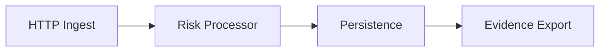

# Data Flow Diagram

Last Updated: 2026-02-17
## High-Level Pipeline

## Detailed Flow

### 1. Ingest
- **Source**: Merchant API Request.
- **Action**: Validate payload, authenticate, rate limit.
- **Data**: Raw Event JSON.

### 2. Processing (Risk Layer)
- **Component**: `RiskScorer`
- **Input**: Event + Window History.
- **Action**: Calculate Risk Score, Determine Risk Band.
- **Output**: Risk Result.

### 3. Storage (Persistence)
- **Primary**: Redis Streams (Events).
- **State**: Redis (Rate Limits, Deduplication).
- **Files**: Local Filesystem (Logs, Snapshots).
- **Retention**:
    - **Events**: 30 days (configurable).
    - **Logs**: 7 days.
    - **Snapshots**: Last 5.

### 4. Export (Evidence)
- **Component**: `GenerateEnvelope`
- **Input**: System State + Metadata.
- **Action**: Normalize, Redact, Sign.
- **Output**: JSON Evidence Envelope.

## Data Persistence Surfaces

| Surface | Data Type | Protection | Retention |
|---|---|---|---|
| **Redis** | Events, Counters | Network Isolation (VPC) | TTL-based |
| **Filesystem** | Logs, Traces | OS Permissions (600) | Log Rotation |
| **Memory** | Hot State | Stack protection | Process Lifetime |

## Deletion Guarantees
- **TTL**: Redis keys expire automatically.
- **Pruning**: Background jobs prune log files > 7 days.
- **Right to Erasure**: Admin API supports "Forget Merchant" command (scrubs Redis and Logs).
